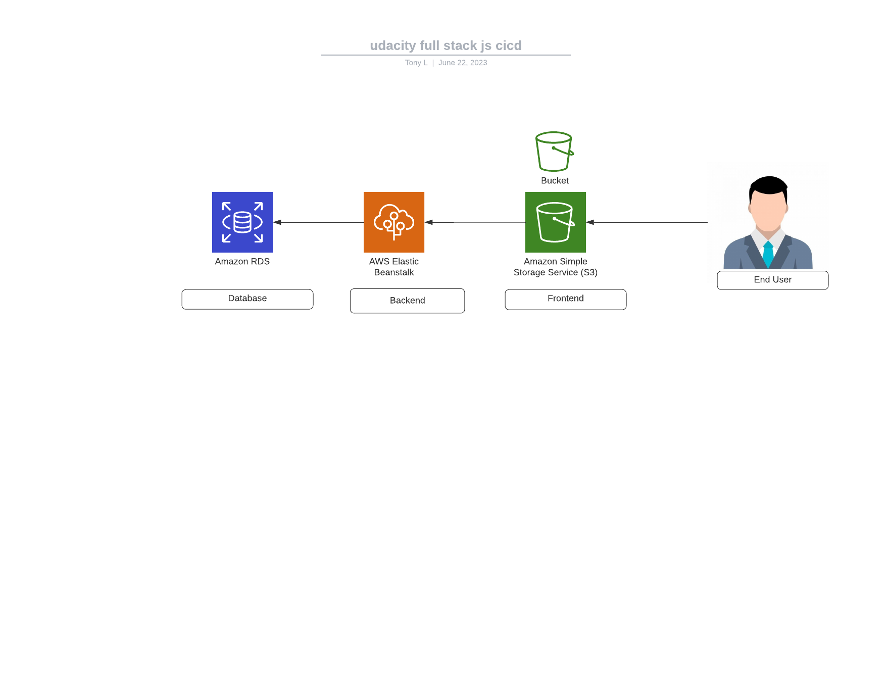

## Infrastructure description

##### AWS Cloud Setup

- S3 Frontend: http://udacity-fullstackjs-cicd-tony.s3-website-us-east-1.amazonaws.com/home
- ElasticBeanstalk - Backend: udagram-api-dev.us-east-1.elasticbeanstalk.com
- RDS - Database Host: database-1.cmqpn3dhhub7.us-east-1.rds.amazonaws.com
- RDS - Database Port: 5432
- RDS - Database Name: database-1

##### Architecture

