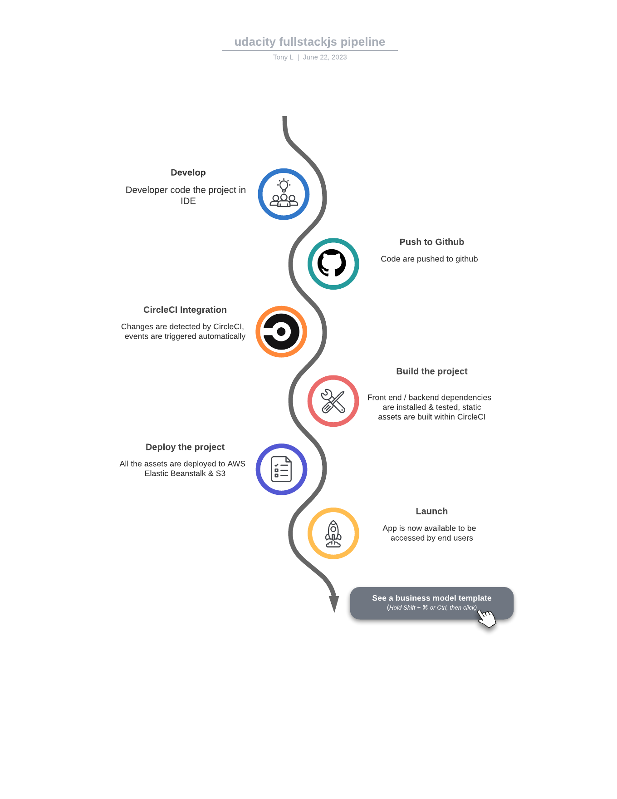

## Pipeline process

```
    "scripts": {
        "frontend:install": "cd udagram/udagram-frontend && npm install -f",
        "frontend:start": "cd udagram/udagram-frontend && npm run start",
        "frontend:build": "cd udagram/udagram-frontend && npm run build",
        "frontend:test": "cd udagram/udagram-frontend && npm run test",
        "frontend:e2e": "cd udagram/udagram-frontend && npm run e2e",
        "frontend:lint": "cd udagram/udagram-frontend && npm run lint",
        "frontend:deploy": "cd udagram/udagram-frontend && npm run deploy",
        "api:install": "cd udagram/udagram-api && npm install .",
        "api:build": "cd udagram/udagram-api && npm run build",
        "api:start": "cd udagram/udagram-api && npm run dev",
        "api:deploy": "cd udagram/udagram-api && npm run deploy",
        "deploy": "npm run api:deploy && npm run frontend:deploy"
    }
```

From the root of the project:
- `npm run frontend:install`    - To install frontend.
- `npm run frontend:build`      - To build frontend.
- `npm run frontend:lint`       - To lint the frontend.
- `npm run frontend:e2e`        - To test the frontend.
- `npm run frontend:deploy`     - To deploy frontend to s3.
- `npm run api:install`         - To install backend.
- `npm run api:build`           - To build the ts backend.
- `npm run api:deploy`          - To deploy the project to EB.


##### CircleCi

Execution order
- build
- hold
- deploy

The pipeline requires manual approval within the hold phase, after the app is being built. Afterwards the app can be deployed.

